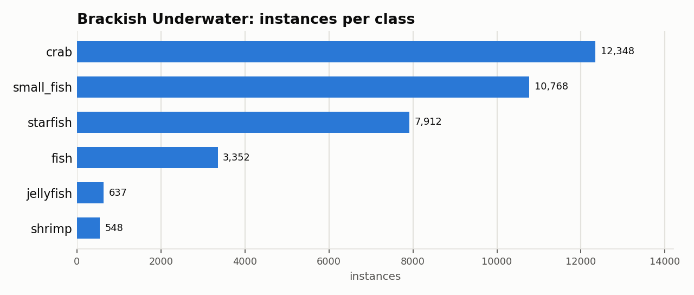

# Brackish Underwater: Dataset Statistics

## About

Brackish is an underwater object-detection benchmark of fish, crabs, and other marine animals, collected with a camera mounted 9 meters below the surface in Limfjorden, a brackish strait near Aalborg, Denmark, under naturally varying visibility conditions. It's used to benchmark underwater detection where color cast, turbidity, and particulate matter degrade standard detectors.

Computed from the canonical COCO layout produced by `detectionbench-prepare-coco --dataset brackish`. See the adapter and Hydra config for how these splits are built.

## Split Summary

| Split | Images | Instances | Instances / Image |
| :--- | ---: | ---: | ---: |
| train | 11,739 | 28,518 | 2.43 |
| valid | 1,467 | 3,581 | 2.44 |
| test | 1,468 | 3,466 | 2.36 |
| **Total** | **14,674** | **35,565** | **2.42** |

## Class Distribution



| Class | Instances | Share |
| :--- | ---: | ---: |
| crab | 12,348 | 34.7% |
| small_fish | 10,768 | 30.3% |
| starfish | 7,912 | 22.2% |
| fish | 3,352 | 9.4% |
| jellyfish | 637 | 1.8% |
| shrimp | 548 | 1.5% |

## Bounding Box Geometry

- Median box area: **0.34%** of image area (mean 0.72%)
- Instances per image: mean **2.42**, median **2**, max **21**

## References

**Citation:**

```bibtex
@InProceedings{pedersen2019brackish,
  title = {Detection of Marine Animals in a New Underwater Dataset with Varying Visibility},
  author = {Pedersen, Malte and Haurum, Joakim Bruslund and Gade, Rikke and Moeslund, Thomas B. and Madsen, Niels},
  booktitle = {The IEEE Conference on Computer Vision and Pattern Recognition (CVPR) Workshops},
  month = {June},
  year = {2019}
}
```

- Project website: <https://www.kaggle.com/datasets/aalborguniversity/brackish-dataset>

---

Regenerate this report with:

```bash
python -m detectionbench.scripts.dataset_stats --coco-dir <brackish_coco> --dataset brackish --output-dir docs/datasets/brackish
```
