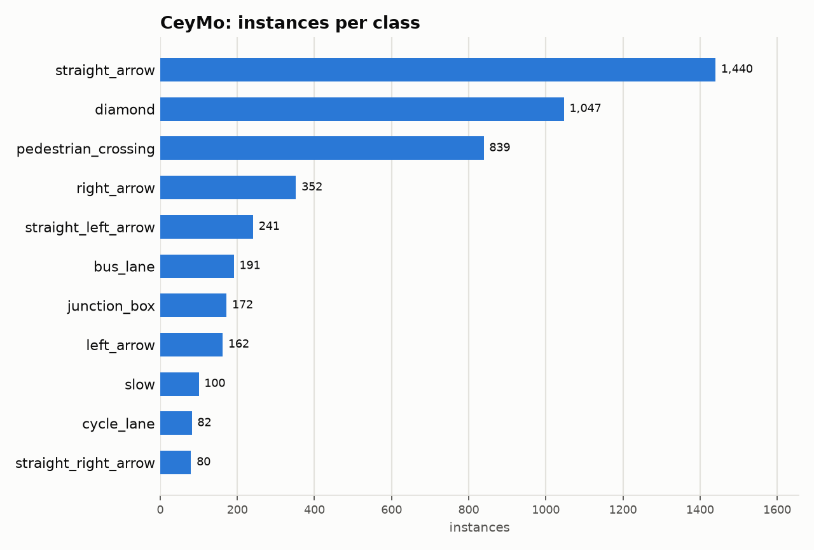

# CeyMo: Dataset Statistics

## About

CeyMo is a road-marking detection benchmark from Sri Lanka: 2,887 1920x1080 road images with 4,706 road-marking instances across 11 classes (arrows, pedestrian crossings, bus/cycle lanes, junction boxes, diamonds, and 'slow' markings), covering urban, sub-urban and rural roads, with a test set spanning normal, crowded, dazzle light, night, rain and shadow conditions. Road markings are flat, perspective-distorted ground-plane objects, unlike the upright vehicles and signs most driving benchmarks target.

Computed from the canonical COCO layout produced by `detectionbench-prepare-coco --dataset ceymo`. See the adapter and Hydra config for how these splits are built.

## Split Summary

| Split | Images | Instances | Instances / Image |
| :--- | ---: | ---: | ---: |
| train | 1,784 | 2,963 | 1.66 |
| valid | 315 | 525 | 1.67 |
| test | 788 | 1,218 | 1.55 |
| **Total** | **2,887** | **4,706** | **1.63** |

## Class Distribution



| Class | Instances | Share |
| :--- | ---: | ---: |
| straight_arrow | 1,440 | 30.6% |
| diamond | 1,047 | 22.2% |
| pedestrian_crossing | 839 | 17.8% |
| right_arrow | 352 | 7.5% |
| straight_left_arrow | 241 | 5.1% |
| bus_lane | 191 | 4.1% |
| junction_box | 172 | 3.7% |
| left_arrow | 162 | 3.4% |
| slow | 100 | 2.1% |
| cycle_lane | 82 | 1.7% |
| straight_right_arrow | 80 | 1.7% |

## Bounding Box Geometry

- Median box area: **0.62%** of image area (mean 2.43%)
- Instances per image: mean **1.63**, median **1**, max **8**

## References

**Citation:**

```bibtex
@InProceedings{Jayasinghe_2022_WACV,
  title={CeyMo: See More on Roads - A Novel Benchmark Dataset for Road Marking Detection},
  author={Jayasinghe, Oshada and Hemachandra, Sahan and Anhettigama, Damith and Kariyawasam, Shenali and Rodrigo, Ranga and Jayasekara, Peshala},
  booktitle={Proceedings of the IEEE/CVF Winter Conference on Applications of Computer Vision (WACV)},
  month={January},
  year={2022},
  pages={3104-3113}
}
```

- Project website: <https://github.com/oshadajay/CeyMo>
- GitHub: <https://github.com/oshadajay/CeyMo>

---

Regenerate this report with:

```bash
python -m detectionbench.scripts.dataset_stats --coco-dir <ceymo_coco> --dataset ceymo --output-dir docs/datasets/ceymo
```
