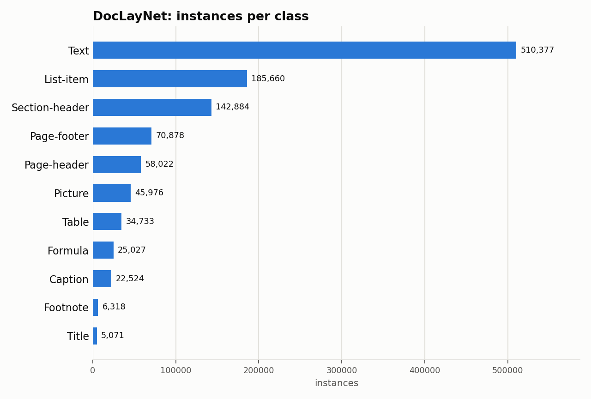

# DocLayNet: Dataset Statistics

## About

DocLayNet is a large, human-annotated dataset for document-layout analysis: 80,863 pages sampled from a diverse mix of financial reports, scientific articles, laws/regulations, patents, and government tenders, manually labeled (unlike the automatically-annotated PubLayNet) across 11 layout classes. It's used to benchmark layout detection models that generalize across document types rather than overfitting to one domain.

Computed from the canonical COCO layout produced by `detectionbench-prepare-coco --dataset doclaynet`. See the adapter and Hydra config for how these splits are built.

## Split Summary

| Split | Images | Instances | Instances / Image |
| :--- | ---: | ---: | ---: |
| train | 69,375 | 941,123 | 13.57 |
| valid | 6,489 | 99,816 | 15.38 |
| test | 4,999 | 66,531 | 13.31 |
| **Total** | **80,863** | **1,107,470** | **13.70** |

## Class Distribution



| Class | Instances | Share |
| :--- | ---: | ---: |
| Text | 510,377 | 46.1% |
| List-item | 185,660 | 16.8% |
| Section-header | 142,884 | 12.9% |
| Page-footer | 70,878 | 6.4% |
| Page-header | 58,022 | 5.2% |
| Picture | 45,976 | 4.2% |
| Table | 34,733 | 3.1% |
| Formula | 25,027 | 2.3% |
| Caption | 22,524 | 2.0% |
| Footnote | 6,318 | 0.6% |
| Title | 5,071 | 0.5% |

## Bounding Box Geometry

- Median box area: **1.12%** of image area (mean 3.10%)
- Instances per image: mean **13.70**, median **13**, max **176**

## References

**Citation:**

```bibtex
@inproceedings{pfitzmann2022doclaynet,
  author={Pfitzmann, Birgit and Auer, Christoph and Dolfi, Michele and Nassar, Ahmed S. and Staar, Peter W. J.},
  title={DocLayNet: A Large Human-Annotated Dataset for Document-Layout Analysis},
  booktitle={Proceedings of the 28th ACM SIGKDD Conference on Knowledge Discovery and Data Mining (KDD)},
  year={2022},
  doi={10.1145/3534678.3539043}
}
```

- Project website: <https://github.com/DS4SD/DocLayNet>

---

Regenerate this report with:

```bash
python -m detectionbench.scripts.dataset_stats --coco-dir <doclaynet_coco> --dataset doclaynet --output-dir docs/datasets/doclaynet
```
