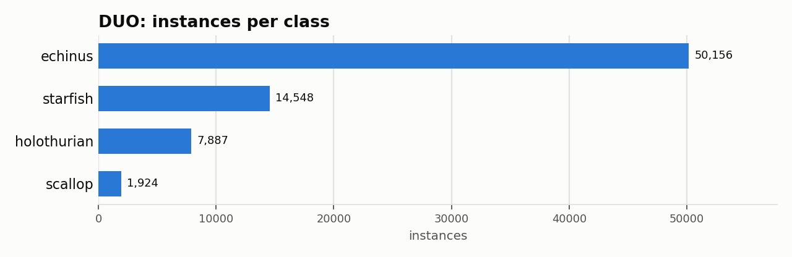

# DUO: Dataset Statistics

## About

DUO is an underwater object-detection benchmark for robot-picking applications: 7,782 images re-annotating and merging the URPC2017-2020 and UDD datasets to fix annotation-quality and train/test-split issues, covering four classes of harvestable organisms (holothurian, echinus, scallop, starfish). It's used to benchmark detectors for automated underwater harvesting robots.

Computed from the canonical COCO layout produced by `detectionbench-prepare-coco --dataset duo`. See the adapter and Hydra config for how these splits are built.

## Split Summary

| Split | Images | Instances | Instances / Image |
| :--- | ---: | ---: | ---: |
| train | 5,670 | 54,613 | 9.63 |
| valid | 1,001 | 9,385 | 9.38 |
| test | 1,111 | 10,517 | 9.47 |
| **Total** | **7,782** | **74,515** | **9.58** |

## Class Distribution



| Class | Instances | Share |
| :--- | ---: | ---: |
| echinus | 50,156 | 67.3% |
| starfish | 14,548 | 19.5% |
| holothurian | 7,887 | 10.6% |
| scallop | 1,924 | 2.6% |

## Bounding Box Geometry

- Median box area: **0.53%** of image area (mean 0.89%)
- Instances per image: mean **9.58**, median **7**, max **98**

## References

**Citation:**

```bibtex
@INPROCEEDINGS{liu2021dataset,
  author={Liu, Chongwei and Wang, Zhihui and Wang, Shijie and Tang, Tao and Tao, Yulong and Yang, Caifei and Li, Haojie and Liu, Xing and Fan, Xin},
  booktitle={2021 IEEE International Conference on Multimedia \& Expo Workshops (ICMEW)},
  title={A Dataset and Benchmark of Underwater Object Detection for Robot Picking},
  year={2021}
}
```

- Project website: <https://github.com/chongweiliu/DUO>

---

Regenerate this report with:

```bash
python -m detectionbench.scripts.dataset_stats --coco-dir <duo_coco> --dataset duo --output-dir docs/datasets/duo
```
