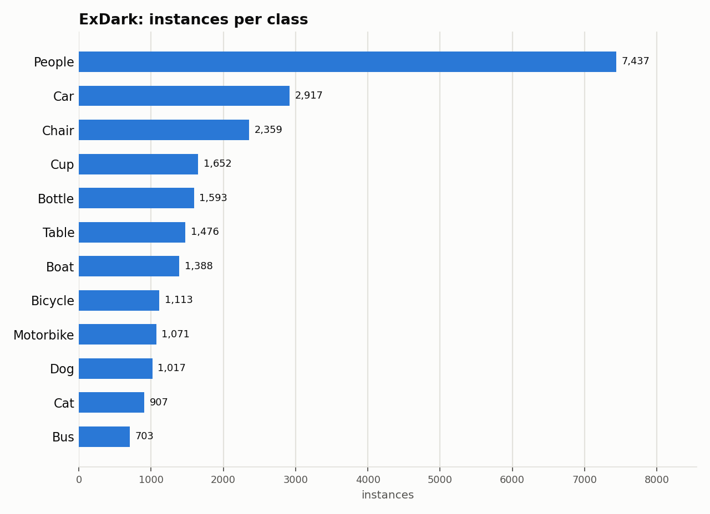

# ExDark: Dataset Statistics

## About

ExDark (Exclusively Dark Image Dataset) is a low-light robustness benchmark: 7,344 images captured across 10 low-light conditions, from very low light to twilight, with both image-level class labels and object-level bounding boxes across 12 classes. It's used to study object detection robustness under degraded illumination, a regime standard COCO- trained detectors handle poorly.

Computed from the canonical COCO layout produced by `detectionbench-prepare-coco --dataset exdark`. See the adapter and Hydra config for how these splits are built.

## Split Summary

| Split | Images | Instances | Instances / Image |
| :--- | ---: | ---: | ---: |
| train | 5,877 | 18,927 | 3.22 |
| valid | 736 | 2,282 | 3.10 |
| test | 734 | 2,424 | 3.30 |
| **Total** | **7,347** | **23,633** | **3.22** |

## Class Distribution



| Class | Instances | Share |
| :--- | ---: | ---: |
| People | 7,437 | 31.5% |
| Car | 2,917 | 12.3% |
| Chair | 2,359 | 10.0% |
| Cup | 1,652 | 7.0% |
| Bottle | 1,593 | 6.7% |
| Table | 1,476 | 6.2% |
| Boat | 1,388 | 5.9% |
| Bicycle | 1,113 | 4.7% |
| Motorbike | 1,071 | 4.5% |
| Dog | 1,017 | 4.3% |
| Cat | 907 | 3.8% |
| Bus | 703 | 3.0% |

## Bounding Box Geometry

- Median box area: **3.92%** of image area (mean 10.22%)
- Instances per image: mean **3.22**, median **2**, max **58**

## References

**Citation:**

```bibtex
@article{Exdark,
  title = {Getting to Know Low-light Images with The Exclusively Dark Dataset},
  author = {Loh, Yuen Peng and Chan, Chee Seng},
  journal = {Computer Vision and Image Understanding},
  volume = {178},
  pages = {30-42},
  year = {2019},
  doi = {https://doi.org/10.1016/j.cviu.2018.10.010}
}
```

- Project website: <https://github.com/cs-chan/Exclusively-Dark-Image-Dataset>

---

Regenerate this report with:

```bash
python -m detectionbench.scripts.dataset_stats --coco-dir <exdark_coco> --dataset exdark --output-dir docs/datasets/exdark
```
