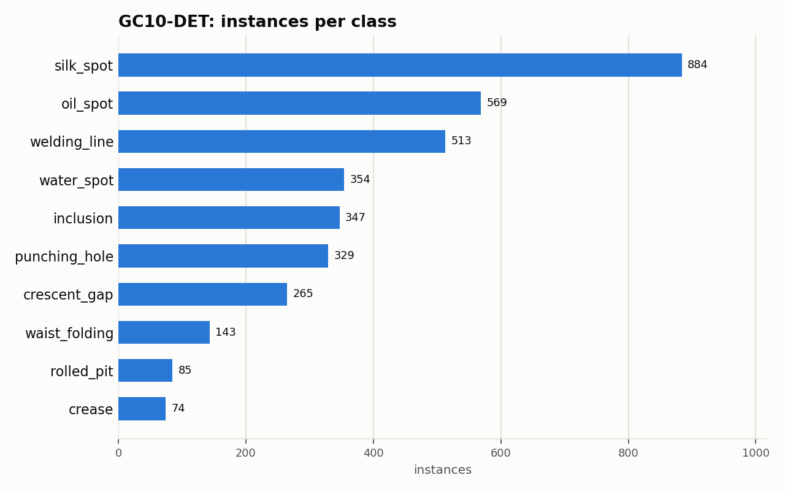

# GC10-DET: Dataset Statistics

## About

GC10-DET is an industrial surface-inspection benchmark: grayscale images of rolled steel sheet surfaces exhibiting 10 common manufacturing defect types, with box-level annotations. It's used to benchmark automated defect localization for quality control on production lines.

Computed from the canonical COCO layout produced by `detectionbench-prepare-coco --dataset gc10det`. See the adapter and Hydra config for how these splits are built.

## Split Summary

| Split | Images | Instances | Instances / Image |
| :--- | ---: | ---: | ---: |
| train | 1,840 | 2,848 | 1.55 |
| valid | 230 | 349 | 1.52 |
| test | 230 | 366 | 1.59 |
| **Total** | **2,300** | **3,563** | **1.55** |

## Class Distribution



| Class | Instances | Share |
| :--- | ---: | ---: |
| silk_spot | 884 | 24.8% |
| oil_spot | 569 | 16.0% |
| welding_line | 513 | 14.4% |
| water_spot | 354 | 9.9% |
| inclusion | 347 | 9.7% |
| punching_hole | 329 | 9.2% |
| crescent_gap | 265 | 7.4% |
| waist_folding | 143 | 4.0% |
| rolled_pit | 85 | 2.4% |
| crease | 74 | 2.1% |

## Bounding Box Geometry

- Median box area: **3.48%** of image area (mean 7.51%)
- Instances per image: mean **1.55**, median **1**, max **11**

## References

**Citation:**

```bibtex
@article{lv2020deep,
  title = {Deep Metallic Surface Defect Detection: The New Benchmark and Detection Network},
  author = {Lv, Xiaoming and Duan, Fajie and Jiang, Jia-jia and Fu, Xiao and Gan, Lin},
  journal = {Sensors},
  volume = {20},
  number = {6},
  pages = {1562},
  year = {2020},
  publisher = {MDPI},
  doi = {10.3390/s20061562}
}
```

- Project website: <https://github.com/lvxiaoming2019/GC10-DET-Metallic-Surface-Defect-Datasets>

---

Regenerate this report with:

```bash
python -m detectionbench.scripts.dataset_stats --coco-dir <gc10det_coco> --dataset gc10det --output-dir docs/datasets/gc10det
```
