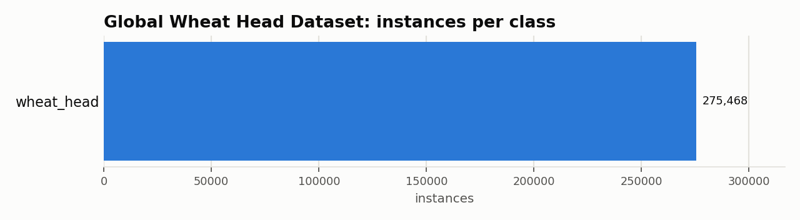

# Global Wheat Head Dataset: Dataset Statistics

## About

GWHD 2021 is a dense, single-class benchmark for wheat head localization, assembled from field images captured across multiple countries and research institutions to maximize genotype, growth-stage, and imaging- condition diversity. It's used to benchmark wheat head detection methods that generalize across environments -- a key requirement for real-world agricultural phenotyping and yield estimation.

Computed from the canonical COCO layout produced by `detectionbench-prepare-coco --dataset gwhd`. See the adapter and Hydra config for how these splits are built.

## Split Summary

| Split | Images | Instances | Instances / Image |
| :--- | ---: | ---: | ---: |
| train | 3,657 | 163,690 | 44.76 |
| valid | 1,476 | 44,347 | 30.05 |
| test | 1,382 | 67,431 | 48.79 |
| **Total** | **6,515** | **275,468** | **42.28** |

## Class Distribution



| Class | Instances | Share |
| :--- | ---: | ---: |
| wheat_head | 275,468 | 100.0% |

## Bounding Box Geometry

- Median box area: **0.43%** of image area (mean 0.59%)
- Instances per image: mean **42.28**, median **39**, max **190**

## References

**Citation:**

```bibtex
@article{david2021global,
  title = {Global Wheat Head Dataset 2021: more diversity to improve the benchmarking of wheat head localization methods},
  author = {David, Etienne and Serouart, Mario and Smith, Daniel and Madec, Simon and Velumani, Kaaviya and Liu, Shouyang and Wang, Xu and Pinto Espinosa, Francisco and Shafiee, Shahameh and Tahir, Izzat S. A. and Tsujimoto, Hisashi and Nasuda, Shuhei and Zheng, Bangyou and Kichgessner, Norbert and Aasen, Helge and Hund, Andreas and Sadhegi-Tehran, Pouria and Nagasawa, Koichi and Ishikawa, Goro and Dandrifosse, S{\'e}bastien and Carlier, Alexis and Mercatoris, Benoit and Kuroki, Ken and Wang, Haozhou and Ishii, Masanori and Badhon, Minhajul A. and Pozniak, Curtis and LeBauer, David Shaner and Lilimo, Morten and Poland, Jesse and Chapman, Scott and de Solan, Benoit and Baret, Fr{\'e}d{\'e}ric and Stavness, Ian and Guo, Wei},
  journal = {Plant Phenomics},
  year = {2021},
  doi = {10.34133/2021/9846158}
}
```

- Project website: <https://www.global-wheat.com/>

---

Regenerate this report with:

```bash
python -m detectionbench.scripts.dataset_stats --coco-dir <gwhd_coco> --dataset gwhd --output-dir docs/datasets/gwhd
```
