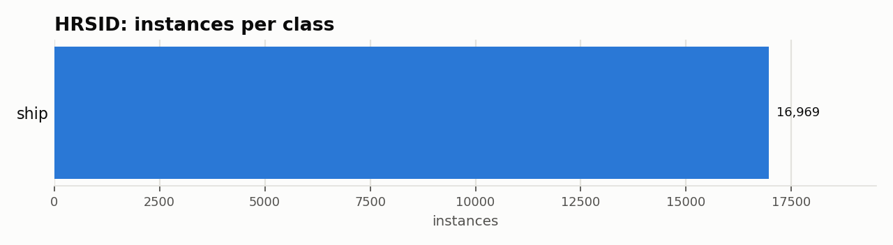

# HRSID: Dataset Statistics

## About

HRSID is a high-resolution Synthetic Aperture Radar (SAR) benchmark for ship detection: 5,604 800x800 image crops (from 136 larger scenes) with 16,951 ship instances, spanning multiple resolutions, polarizations, sea states, and coastal/open-sea conditions, sourced from Sentinel-1B, TerraSAR-X, and TanDEM-X. It's used to benchmark ship detection in SAR imagery, where speckle noise and side-lobe artifacts make optical-trained detectors unreliable.

Computed from the canonical COCO layout produced by `detectionbench-prepare-coco --dataset hrsid`. See the adapter and Hydra config for how these splits are built.

## Split Summary

| Split | Images | Instances | Instances / Image |
| :--- | ---: | ---: | ---: |
| train | 3,096 | 9,143 | 2.95 |
| valid | 546 | 1,904 | 3.49 |
| test | 1,962 | 5,922 | 3.02 |
| **Total** | **5,604** | **16,969** | **3.03** |

## Class Distribution



| Class | Instances | Share |
| :--- | ---: | ---: |
| ship | 16,969 | 100.0% |

## Bounding Box Geometry

- Median box area: **0.14%** of image area (mean 0.28%)
- Instances per image: mean **3.03**, median **2**, max **163**

## References

**Citation:**

```bibtex
@ARTICLE{wei2020hrsid,
  author={Wei, Shunjun and Zeng, Xiangfeng and Qu, Qizhe and Wang, Mou and Su, Hao and Shi, Jun},
  journal={IEEE Access},
  title={HRSID: A High-Resolution SAR Images Dataset for Ship Detection and Instance Segmentation},
  year={2020},
  volume={8},
  pages={120234-120254},
  doi={10.1109/ACCESS.2020.3005861}
}
```

- Project website: <https://github.com/chaozhong2010/HRSID>

---

Regenerate this report with:

```bash
python -m detectionbench.scripts.dataset_stats --coco-dir <hrsid_coco> --dataset hrsid --output-dir docs/datasets/hrsid
```
