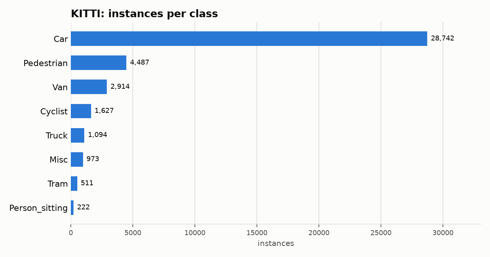

# KITTI: Dataset Statistics

## About

KITTI is a foundational autonomous-driving benchmark: street scenes captured from a moving vehicle in and around Karlsruhe, Germany, annotated for 2D object detection across 8 classes (Car, Cyclist, Misc, Pedestrian, Person_sitting, Tram, Truck, Van). Only the officially labelled 7,481 images are usable (test-set boxes are not public); this adapter splits them train/valid using the Chen et al. (2015) 3712/3769 split, the de facto standard used across the KITTI detection literature.

Computed from the canonical COCO layout produced by `detectionbench-prepare-coco --dataset kitti`. See the adapter and Hydra config for how these splits are built.

## Split Summary

| Split | Images | Instances | Instances / Image |
| :--- | ---: | ---: | ---: |
| train | 3,712 | 19,700 | 5.31 |
| valid | 3,769 | 20,870 | 5.54 |
| **Total** | **7,481** | **40,570** | **5.42** |

## Class Distribution



| Class | Instances | Share |
| :--- | ---: | ---: |
| Car | 28,742 | 70.8% |
| Pedestrian | 4,487 | 11.1% |
| Van | 2,914 | 7.2% |
| Cyclist | 1,627 | 4.0% |
| Truck | 1,094 | 2.7% |
| Misc | 973 | 2.4% |
| Tram | 511 | 1.3% |
| Person_sitting | 222 | 0.5% |

## Bounding Box Geometry

- Median box area: **0.77%** of image area (mean 2.39%)
- Instances per image: mean **5.42**, median **5**, max **22**

## References

**Citation:**

```bibtex
@inproceedings{geiger2012kitti,
  title={Are we ready for autonomous driving? The KITTI vision benchmark suite},
  author={Geiger, Andreas and Lenz, Philip and Urtasun, Raquel},
  booktitle={2012 IEEE Conference on Computer Vision and Pattern Recognition},
  pages={3354--3361},
  year={2012},
  organization={IEEE},
  doi={10.1109/CVPR.2012.6248074}
}
```

- Project website: <https://www.cvlibs.net/datasets/kitti/>

---

Regenerate this report with:

```bash
python -m detectionbench.scripts.dataset_stats --coco-dir <kitti_coco> --dataset kitti --output-dir docs/datasets/kitti
```
