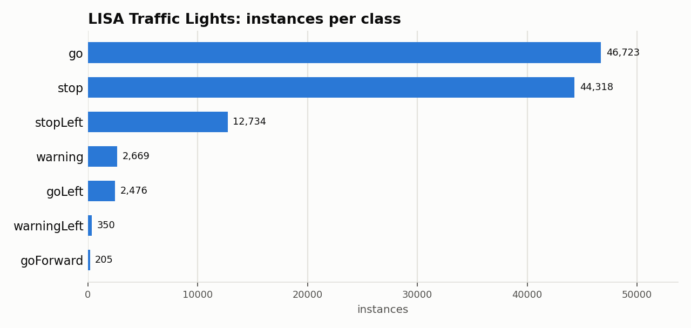
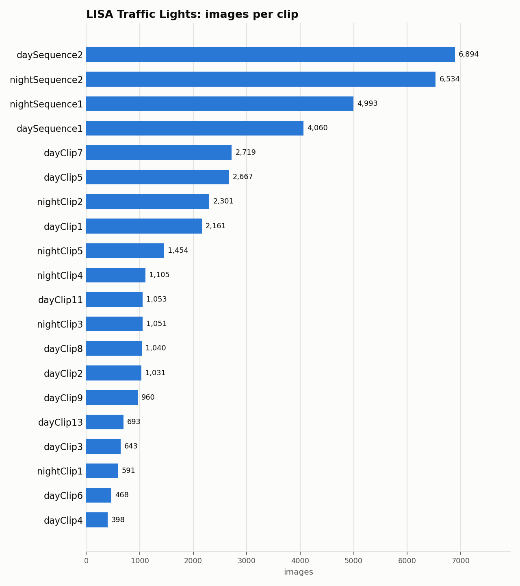

# LISA Traffic Lights: Dataset Statistics

## About

The LISA Traffic Light Dataset is a benchmark for traffic-light detection and recognition: continuous day/night video sequences recorded in San Diego, California, under varying light and weather. It's used to benchmark autonomous-vehicle and ADAS perception systems on a safety- critical, small-object detection task; this adapter carries the box- annotation variant.

Computed from the canonical COCO layout produced by `detectionbench-prepare-coco --dataset lisa`. See the adapter and Hydra config for how these splits are built.

## Split Summary

| Split | Images | Instances | Instances / Image |
| :--- | ---: | ---: | ---: |
| train | 17,082 | 44,657 | 2.61 |
| valid | 3,454 | 7,169 | 2.08 |
| test | 22,481 | 57,649 | 2.56 |
| **Total** | **43,017** | **109,475** | **2.54** |

## Class Distribution



| Class | Instances | Share |
| :--- | ---: | ---: |
| go | 46,723 | 42.7% |
| stop | 44,318 | 40.5% |
| stopLeft | 12,734 | 11.6% |
| warning | 2,669 | 2.4% |
| goLeft | 2,476 | 2.3% |
| warningLeft | 350 | 0.3% |
| goForward | 205 | 0.2% |

## Per-Clip Breakdown

22 distinct clips across all splits (top 20 shown below by image count).



## Bounding Box Geometry

- Median box area: **0.06%** of image area (mean 0.11%)
- Instances per image: mean **2.54**, median **3**, max **11**

## References

**Citation:**

```bibtex
@article{jensen2016vision,
  title={Vision for looking at traffic lights: Issues, survey, and perspectives},
  author={Jensen, Morten Born{\o} and Philipsen, Mark Philip and M{\o}gelmose, Andreas and Moeslund, Thomas Baltzer and Trivedi, Mohan Manubhai},
  journal={IEEE Transactions on Intelligent Transportation Systems},
  volume={17},
  number={7},
  pages={1800--1815},
  year={2016},
  doi={10.1109/TITS.2015.2509509},
  publisher={IEEE}
}
```

- Project website: <https://www.kaggle.com/datasets/mbornoe/lisa-traffic-light-dataset>

---

Regenerate this report with:

```bash
python -m detectionbench.scripts.dataset_stats --coco-dir <lisa_coco> --dataset lisa --output-dir docs/datasets/lisa --group-label clip
```
