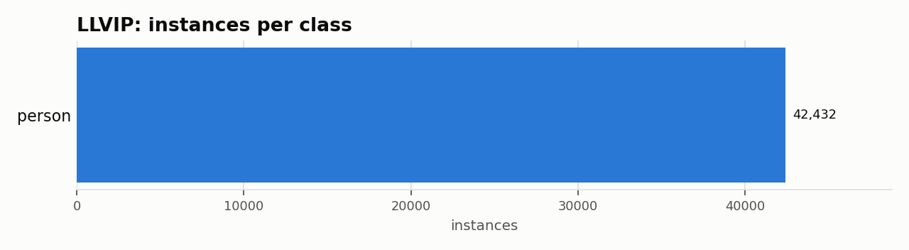

# LLVIP: Dataset Statistics

## About

LLVIP is a registered visible/infrared image-pair dataset for pedestrian detection in low-light conditions: 30,976 image pairs (paired visible + infrared frames, pixel-aligned) captured at night, annotated with pedestrian bounding boxes. Its central finding is that infrared imagery is dramatically more useful than visible imagery under these conditions -- this adapter uses the infrared images only.

Computed from the canonical COCO layout produced by `detectionbench-prepare-coco --dataset llvip`. See the adapter and Hydra config for how these splits are built.

## Split Summary

| Split | Images | Instances | Instances / Image |
| :--- | ---: | ---: | ---: |
| train | 10,221 | 29,113 | 2.85 |
| valid | 1,804 | 5,017 | 2.78 |
| test | 3,463 | 8,302 | 2.40 |
| **Total** | **15,488** | **42,432** | **2.74** |

## Class Distribution



| Class | Instances | Share |
| :--- | ---: | ---: |
| person | 42,432 | 100.0% |

## Bounding Box Geometry

- Median box area: **1.60%** of image area (mean 1.68%)
- Instances per image: mean **2.74**, median **2**, max **13**

## References

**Citation:**

```bibtex
@inproceedings{jia2021llvip,
  title={LLVIP: A Visible-infrared Paired Dataset for Low-light Vision},
  author={Jia, Xinyu and Zhu, Chuang and Li, Minzhen and Tang, Wenqi and Zhou, Wenli},
  booktitle={Proceedings of the IEEE/CVF International Conference on Computer Vision Workshops},
  pages={3496--3504},
  year={2021}
}
```

- Project website: <https://github.com/bupt-ai-cz/LLVIP>

---

Regenerate this report with:

```bash
python -m detectionbench.scripts.dataset_stats --coco-dir <llvip_coco> --dataset llvip --output-dir docs/datasets/llvip
```
