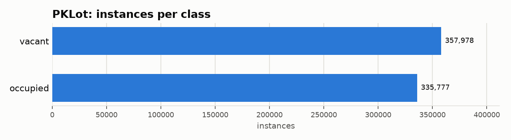
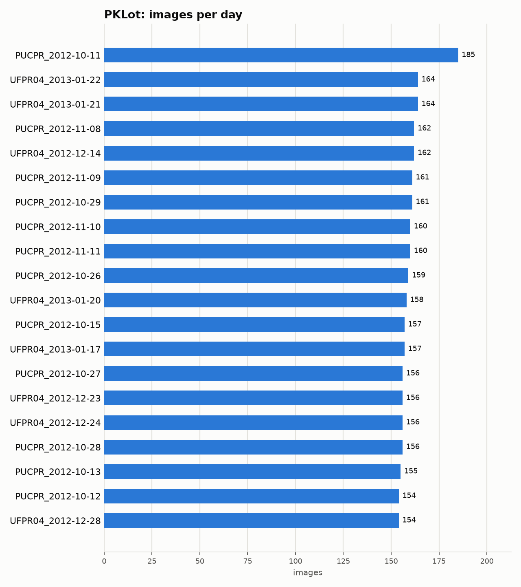

# PKLot: Dataset Statistics

## About

PKLot is a parking-lot occupancy benchmark: 12,417 1280x720 frames from three fixed cameras (PUCPR, UFPR04, UFPR05) under sunny, cloudy and rainy conditions, with roughly 694k labelled parking spaces marked occupied or vacant. Its original task classifies each fixed space; here every space is a bounding box to detect and classify, so results are not comparable to free-form car detection.

Computed from the canonical COCO layout produced by `detectionbench-prepare-coco --dataset pklot`. See the adapter and Hydra config for how these splits are built.

## Split Summary

| Split | Images | Instances | Instances / Image |
| :--- | ---: | ---: | ---: |
| train | 8,346 | 466,306 | 55.87 |
| valid | 1,981 | 104,014 | 52.51 |
| test | 2,089 | 123,435 | 59.09 |
| **Total** | **12,416** | **693,755** | **55.88** |

## Class Distribution



| Class | Instances | Share |
| :--- | ---: | ---: |
| vacant | 357,978 | 51.6% |
| occupied | 335,777 | 48.4% |

## Per-Day Breakdown

100 distinct days across all splits (top 20 shown below by image count).



## Bounding Box Geometry

- Median box area: **0.35%** of image area (mean 0.48%)
- Instances per image: mean **55.88**, median **40**, max **100**

## References

**Citation:**

```bibtex
@article{almeida2015pklot,
  title={PKLot -- A robust dataset for parking lot classification},
  author={de Almeida, Paulo R. L. and Oliveira, Luiz S. and Britto Jr, Alceu S. and Silva Jr, Eunelson J. and Koerich, Alessandro L.},
  journal={Expert Systems with Applications},
  volume={42},
  number={11},
  pages={4937--4949},
  year={2015},
  doi={10.1016/j.eswa.2015.02.009}
}
```

- Project website: <https://web.inf.ufpr.br/vri/databases/parking-lot-database/>

---

Regenerate this report with:

```bash
python -m detectionbench.scripts.dataset_stats --coco-dir <pklot_coco> --dataset pklot --output-dir docs/datasets/pklot --group-label day
```
