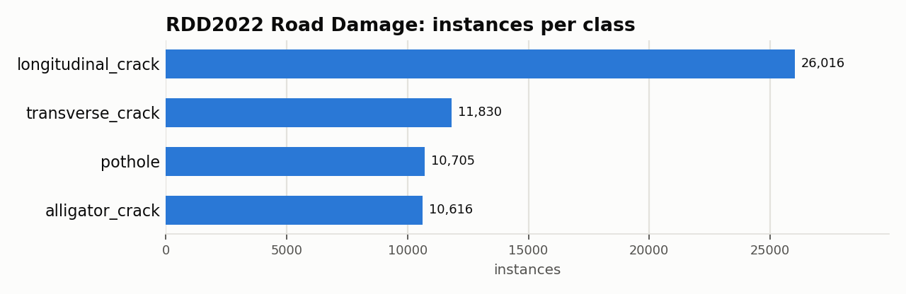
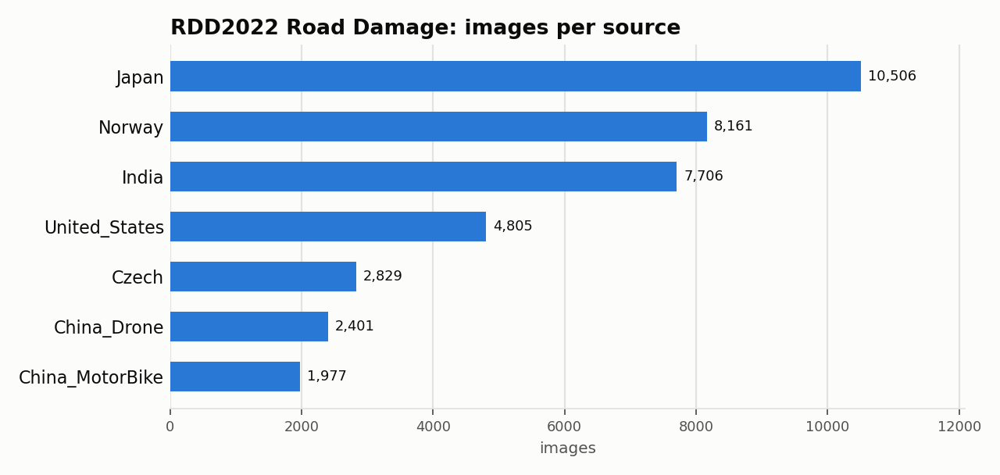

# RDD2022 Road Damage: Dataset Statistics

## About

RDD2022 is a multi-national street-level road-damage detection benchmark: 47,420 road images from six countries (Japan, India, Czech Republic, Norway, United States, China), captured with vehicle-mounted smartphones, dashboard cameras, and drones, annotated for pavement distress across four CRDDC2022 damage types. It's used to benchmark automatic road- condition assessment across diverse road types, imaging setups, and damage conventions.

Computed from the canonical COCO layout produced by `detectionbench-prepare-coco --dataset rdd2022`. See the adapter and Hydra config for how these splits are built.

## Split Summary

| Split | Images | Instances | Instances / Image |
| :--- | ---: | ---: | ---: |
| train | 26,869 | 41,667 | 1.55 |
| valid | 5,758 | 8,776 | 1.52 |
| test | 5,758 | 8,724 | 1.52 |
| **Total** | **38,385** | **59,167** | **1.54** |

## Class Distribution



| Class | Instances | Share |
| :--- | ---: | ---: |
| longitudinal_crack | 26,016 | 44.0% |
| transverse_crack | 11,830 | 20.0% |
| pothole | 10,705 | 18.1% |
| alligator_crack | 10,616 | 17.9% |

## Per-Source Breakdown

7 distinct sources across all splits.



## Bounding Box Geometry

- Median box area: **1.73%** of image area (mean 4.95%)
- Instances per image: mean **1.54**, median **1**, max **44**

## References

**Citation:**

```bibtex
@article{arya2022rdd2022,
  title = {RDD2022: A multi-national image dataset for automatic Road Damage Detection},
  author = {Arya, Deeksha and Maeda, Hiroya and Ghosh, Sanjay Kumar and Toshniwal, Durga and Sekimoto, Yoshihide},
  journal = {arXiv preprint arXiv:2209.08538},
  year = {2022}
}
```

- Project website: <https://github.com/sekilab/RoadDamageDetector>

---

Regenerate this report with:

```bash
python -m detectionbench.scripts.dataset_stats --coco-dir <rdd2022_coco> --dataset rdd2022 --output-dir docs/datasets/rdd2022 --group-label source
```
