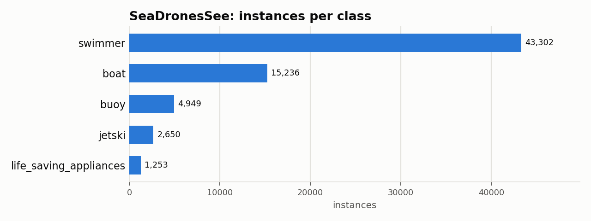

# SeaDronesSee: Dataset Statistics

## About

SeaDronesSee is a maritime search-and-rescue benchmark: images and video captured by UAVs over open water, annotated for detecting swimmers, boats, jet skis, life-saving appliances, and buoys. It's used to benchmark drone-based maritime search-and-rescue detection systems; this adapter covers the Object Detection v2 track.

Computed from the canonical COCO layout produced by `detectionbench-prepare-coco --dataset seadronessee`. See the adapter and Hydra config for how these splits are built.

## Split Summary

| Split | Images | Instances | Instances / Image |
| :--- | ---: | ---: | ---: |
| train | 8,930 | 57,760 | 6.47 |
| valid | 1,547 | 9,630 | 6.22 |
| **Total** | **10,477** | **67,390** | **6.43** |

## Class Distribution



| Class | Instances | Share |
| :--- | ---: | ---: |
| swimmer | 43,302 | 64.3% |
| boat | 15,236 | 22.6% |
| buoy | 4,949 | 7.3% |
| jetski | 2,650 | 3.9% |
| life_saving_appliances | 1,253 | 1.9% |

## Bounding Box Geometry

- Median box area: **0.03%** of image area (mean 0.13%)
- Instances per image: mean **6.43**, median **6**, max **16**

## References

**Citation:**

```bibtex
@inproceedings{varga2022seadronessee,
  title={SeaDronesSee: A maritime benchmark for detecting humans in open water},
  author={Varga, Leon Amadeus and Kiefer, Benjamin and Messmer, Martin and Zell, Andreas},
  booktitle={Proceedings of the IEEE/CVF Winter Conference on Applications of Computer Vision},
  pages={2260--2270},
  year={2022}
}
```

- Project website: <https://seadronessee.cs.uni-tuebingen.de/>
- GitHub: <https://github.com/Ben93kie/SeaDronesSee>

---

Regenerate this report with:

```bash
python -m detectionbench.scripts.dataset_stats --coco-dir <seadronessee_coco> --dataset seadronessee --output-dir docs/datasets/seadronessee
```
