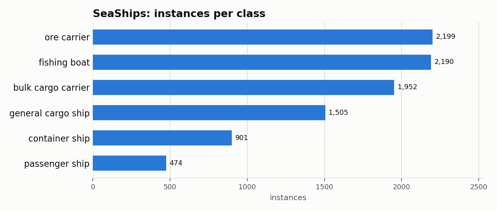

# SeaShips: Dataset Statistics

## About

SeaShips is a maritime ship-detection benchmark of 7,000 images sampled from a deployed coastline video-surveillance system, covering six ship types (ore carrier, bulk cargo carrier, general cargo ship, container ship, fishing boat, passenger ship). It's used to benchmark ship detection under realistic maritime variation in scale, viewpoint, illumination, and occlusion.

Computed from the canonical COCO layout produced by `detectionbench-prepare-coco --dataset seaships`. See the adapter and Hydra config for how these splits are built.

## Split Summary

| Split | Images | Instances | Instances / Image |
| :--- | ---: | ---: | ---: |
| train | 1,750 | 2,279 | 1.30 |
| valid | 1,750 | 2,259 | 1.29 |
| test | 3,500 | 4,683 | 1.34 |
| **Total** | **7,000** | **9,221** | **1.32** |

## Class Distribution



| Class | Instances | Share |
| :--- | ---: | ---: |
| ore carrier | 2,199 | 23.8% |
| fishing boat | 2,190 | 23.8% |
| bulk cargo carrier | 1,952 | 21.2% |
| general cargo ship | 1,505 | 16.3% |
| container ship | 901 | 9.8% |
| passenger ship | 474 | 5.1% |

## Bounding Box Geometry

- Median box area: **3.64%** of image area (mean 5.85%)
- Instances per image: mean **1.32**, median **1**, max **5**

## References

**Citation:**

```bibtex
@ARTICLE{shao2018seaships,
  author={Shao, Zhenfeng and Wu, Wenjing and Wang, Zhongyuan and Du, Wan and Li, Chengyuan},
  journal={IEEE Transactions on Multimedia},
  title={SeaShips: A Large-Scale Precisely Annotated Dataset for Ship Detection},
  year={2018},
  volume={20},
  number={10},
  pages={2593-2604},
  doi={10.1109/TMM.2018.2865686}
}
```

- Project website: <https://github.com/jiaming-wang/SeaShips>

---

Regenerate this report with:

```bash
python -m detectionbench.scripts.dataset_stats --coco-dir <seaships_coco> --dataset seaships --output-dir docs/datasets/seaships
```
