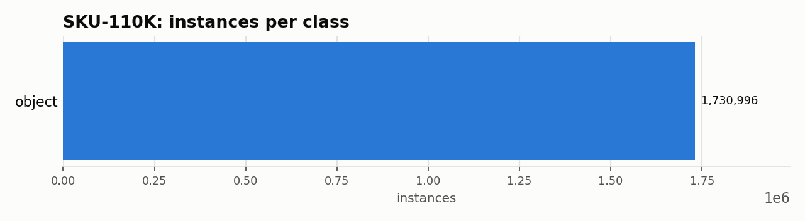

# SKU-110K: Dataset Statistics

## About

SKU-110K is a dense, single-class retail-shelf object-detection benchmark: 11,743 images of store shelves with items packed edge to edge. It's used to stress-test detectors on extreme object density and overlap rather than fine-grained SKU classification -- despite the name, every box is labeled a single class, `object`.

Computed from the canonical COCO layout produced by `detectionbench-prepare-coco --dataset sku110k`. See the adapter and Hydra config for how these splits are built.

## Split Summary

| Split | Images | Instances | Instances / Image |
| :--- | ---: | ---: | ---: |
| train | 8,219 | 1,208,482 | 147.04 |
| valid | 588 | 90,968 | 154.71 |
| test | 2,936 | 431,546 | 146.98 |
| **Total** | **11,743** | **1,730,996** | **147.41** |

## Class Distribution



| Class | Instances | Share |
| :--- | ---: | ---: |
| object | 1,730,996 | 100.0% |

## Bounding Box Geometry

- Median box area: **0.24%** of image area (mean 0.29%)
- Instances per image: mean **147.41**, median **138**, max **718**

## References

**Citation:**

```bibtex
@inproceedings{goldman2019dense,
  title={Precise Detection in Densely Packed Scenes},
  author={Goldman, Eran and Herzig, Roei and Eisenschtat, Aviv and Goldberger, Jacob and Hassner, Tal},
  booktitle={Proceedings of the IEEE/CVF Conference on Computer Vision and Pattern Recognition},
  pages={5227--5236},
  year={2019}
}
```

- Project website: <https://github.com/eg4000/SKU110K_CVPR19>

---

Regenerate this report with:

```bash
python -m detectionbench.scripts.dataset_stats --coco-dir <sku110k_coco> --dataset sku110k --output-dir docs/datasets/sku110k
```
