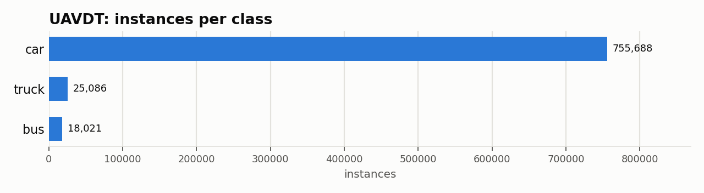
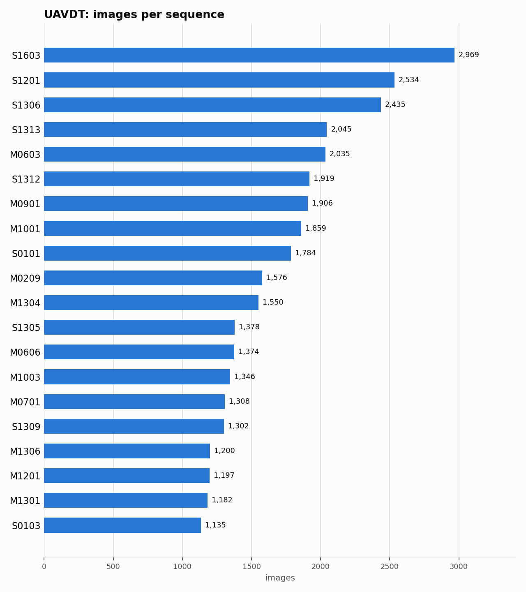

# UAVDT: Dataset Statistics

## About

UAVDT (UAV Detection and Tracking) is a large-scale benchmark for vehicle detection, single-object tracking, and multi-object tracking from footage captured by an unmanned aerial vehicle. It consists of about 80,000 representative frames from 100 video sequences, densely annotated with car/truck/bus bounding boxes plus per-sequence attributes (weather, flying altitude, camera view, vehicle category, occlusion). It's used to study detection and tracking under conditions aerial traffic-surveillance systems actually face: small objects, dense traffic, occlusion, and large viewpoint/altitude changes -- this adapter uses the detection-subset labels only.

Computed from the canonical COCO layout produced by `detectionbench-prepare-coco --dataset uavdt`. See the adapter and Hydra config for how these splits are built.

## Split Summary

| Split | Images | Instances | Instances / Image |
| :--- | ---: | ---: | ---: |
| train | 20,591 | 323,467 | 15.71 |
| valid | 3,552 | 99,444 | 28.00 |
| test | 53,676 | 375,884 | 7.00 |
| **Total** | **77,819** | **798,795** | **10.26** |

## Class Distribution



| Class | Instances | Share |
| :--- | ---: | ---: |
| car | 755,688 | 94.6% |
| truck | 25,086 | 3.1% |
| bus | 18,021 | 2.3% |

## Per-Sequence Breakdown

100 distinct sequences across all splits (top 20 shown below by image count).



## Bounding Box Geometry

- Median box area: **0.14%** of image area (mean 0.26%)
- Instances per image: mean **10.26**, median **3**, max **107**

## References

**Citation:**

```bibtex
@InProceedings{du2018unmanned,
  title={The Unmanned Aerial Vehicle Benchmark: Object Detection and Tracking},
  author={Du, Dawei and Qi, Yuankai and Yu, Hongyang and Yang, Yifan and Duan, Kaiwen and Li, Guorong and Zhang, Weigang and Huang, Qingming and Tian, Qi},
  booktitle={Proceedings of the European Conference on Computer Vision (ECCV)},
  year={2018}
}
```

- Project website: <https://sites.google.com/view/grli-uavdt>

---

Regenerate this report with:

```bash
python -m detectionbench.scripts.dataset_stats --coco-dir <uavdt_coco> --dataset uavdt --output-dir docs/datasets/uavdt --group-label sequence
```
