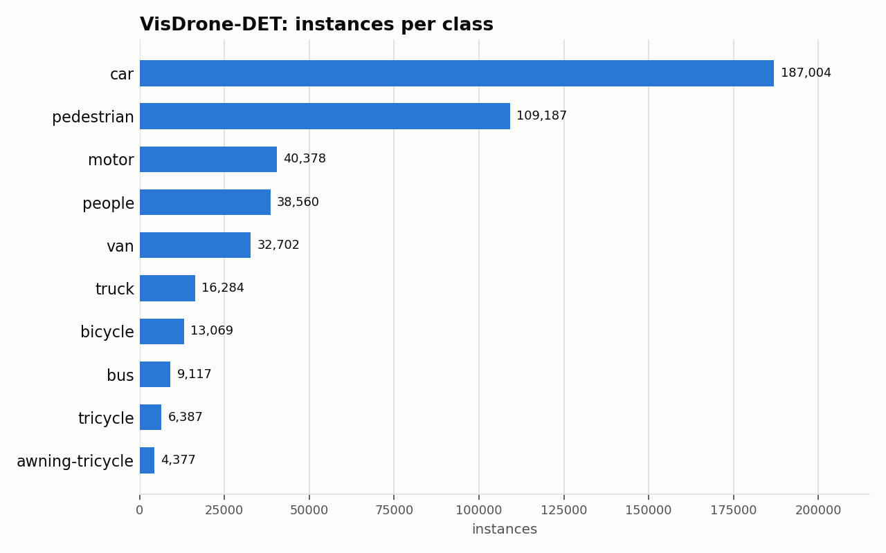
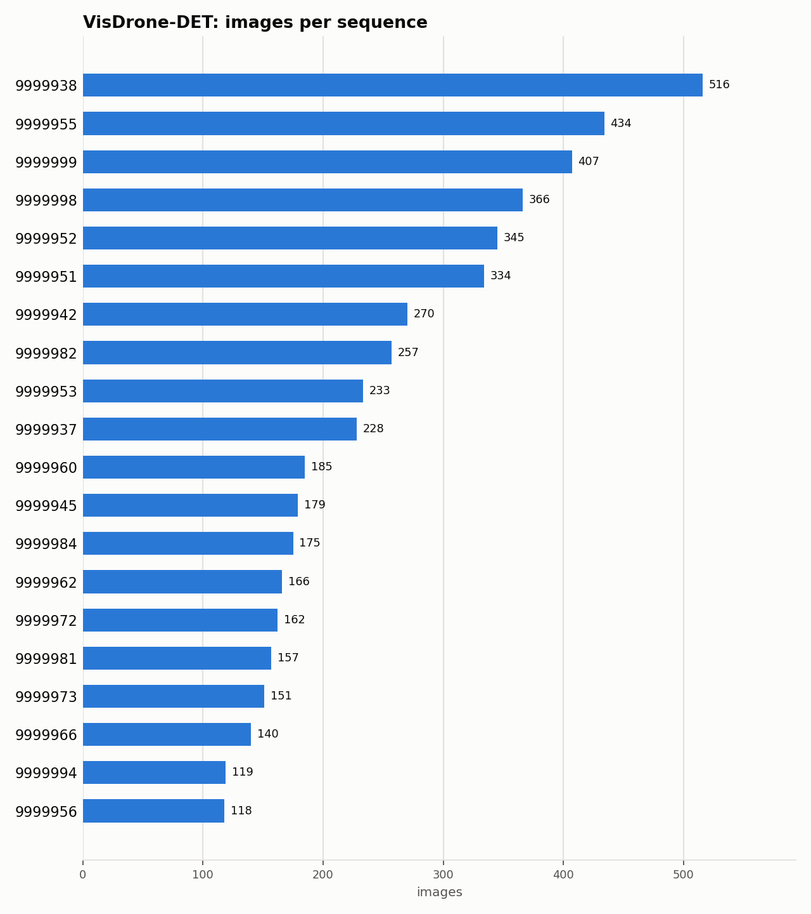

# VisDrone-DET: Dataset Statistics

## About

VisDrone-DET is a large-scale drone-captured benchmark for object detection: images and video from diverse cities, scenarios, and weather/lighting conditions across China, annotated across common object categories (pedestrian, car, van, truck, and more). It's used to benchmark detection from an aerial/drone viewpoint, where small, dense, and often-occluded objects are the norm.

Computed from the canonical COCO layout produced by `detectionbench-prepare-coco --dataset visdrone`. See the adapter and Hydra config for how these splits are built.

## Split Summary

| Split | Images | Instances | Instances / Image |
| :--- | ---: | ---: | ---: |
| train | 6,471 | 343,204 | 53.04 |
| valid | 548 | 38,759 | 70.73 |
| test | 1,610 | 75,102 | 46.65 |
| **Total** | **8,629** | **457,065** | **52.97** |

## Class Distribution



| Class | Instances | Share |
| :--- | ---: | ---: |
| car | 187,004 | 40.9% |
| pedestrian | 109,187 | 23.9% |
| motor | 40,378 | 8.8% |
| people | 38,560 | 8.4% |
| van | 32,702 | 7.2% |
| truck | 16,284 | 3.6% |
| bicycle | 13,069 | 2.9% |
| bus | 9,117 | 2.0% |
| tricycle | 6,387 | 1.4% |
| awning-tricycle | 4,377 | 1.0% |

## Per-Sequence Breakdown

321 distinct sequences across all splits (top 20 shown below by image count).



## Bounding Box Geometry

- Median box area: **0.05%** of image area (mean 0.15%)
- Instances per image: mean **52.97**, median **42**, max **902**

## References

**Citation:**

```bibtex
@article{zhu2021detection,
  title={Detection and Tracking Meet Drones Challenge},
  author={Zhu, Pengfei and Wen, Longyin and Du, Dawei and Bian, Xiao and Fan, Heng and Hu, Qinghua and Ling, Haibin},
  journal={IEEE Transactions on Pattern Analysis and Machine Intelligence},
  volume={44},
  number={11},
  pages={7380--7399},
  year={2021}
}
```

- Project website: <https://github.com/VisDrone/VisDrone-Dataset>

---

Regenerate this report with:

```bash
python -m detectionbench.scripts.dataset_stats --coco-dir <visdrone_coco> --dataset visdrone --output-dir docs/datasets/visdrone --group-label sequence
```
